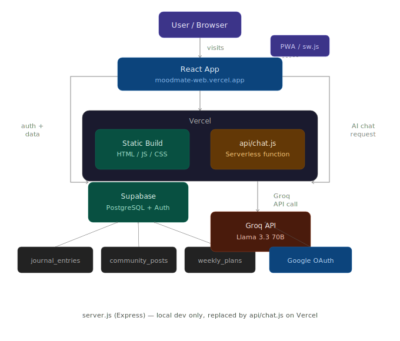

# 🌙 MoodMate — AI Mental Wellness App
 
> Your AI-powered mental wellness companion. Journal your moods, chat with Aura, and understand your emotional patterns.
 
**Live Demo:** [moodmate-web.vercel.app](https://moodmate-web.vercel.app)
 
---
 
## ✨ Features
 
| Feature | Description |
|---|---|
| 📓 AI Journal | Write entries, get AI reflection & actionable steps from Aura |
| 💬 Aura Chat | Real-time AI wellness companion |
| 🧠 Mood Prediction | AI predicts tomorrow's mood based on your patterns |
| 🎯 Weekly Plan | Personalized 7-day AI therapy plan |
| 🫂 Community | Anonymous shared entries — you're not alone |
| 📊 Analytics | Mood charts, heatmap calendar, sentiment analysis |
| 🏆 Achievements | 10 unlockable badges with confetti |
| 🎙️ Voice Journal | Hindi, English & Hinglish voice input |
| 🌿 Relief Exercises | Box breathing, grounding, PMR |
| 🎵 Ambient Sounds | Rain, ocean, forest, fire |
| 📱 PWA | Installable on mobile & desktop |
| 💰 Pricing | Free + Pro plan |
| 👨‍⚕️ Doctor Connect | Coming soon — AI + therapist hybrid |
 
---
 
## 🏗️ Architecture
 
```
User / Browser
      │  visits
      ▼
React App (moodmate-web.vercel.app)
      │                        │
      │ auth + journal data    │ AI chat request
      ▼                        ▼
  Supabase                api/chat.js
  PostgreSQL           (Vercel Serverless)
  + Auth                      │
      │                       │ Groq API call
  ┌───┴──────────┐            ▼
  journal_entries         Groq API
  community_posts      Llama 3.3 70B
  weekly_plans
  
> server.js (Express) — local dev only, replaced by api/chat.js on Vercel
```
 
 
**Production:** React → Vercel Serverless Function → Groq API  
**Database:** React → Supabase directly (with RLS policies)  
**Deploy:** GitHub push → Vercel auto-deploys
 
---
 
## 🛠️ Tech Stack
 
- **Frontend:** React 19, Tailwind CSS, Glassmorphism UI
- **Serverless:** Vercel (api/chat.js)
- **Local Dev Server:** Express.js (server.js)
- **Database:** Supabase (PostgreSQL + Auth)
- **AI:** Groq API — Llama 3.3 70B (free tier)
- **Auth:** Email/Password + Google OAuth

- ## 🏗️ WorkFlow
- 
  
- ## 📁 Project Structure
 
```
moodmate/
├── api/
│   └── chat.js              ← Vercel serverless function (Groq proxy)
├── server.js                ← Express proxy for local development
├── public/
│   ├── sw.js                ← Service Worker (PWA)
│   ├── manifest.json        ← PWA manifest
│   └── sidebar.png          ← App icon
└── src/
    ├── App.js               ← Main app + all views
    ├── constants.js         ← moodMap, callAI, achievements
    ├── supabase.js          ← Supabase client
    ├── components/UI.js     ← GlobalStyles, Icons, components
    ├── hooks/
    │   ├── useVoice.js      ← Voice journaling hook
    │   └── useReminder.js   ← Push notification reminders
    └── pages/
        ├── LandingPage.js
        ├── AuthScreen.js
        ├── OnboardingPage.js
        ├── DashboardView.js
        ├── MoodPredictionView.js
        ├── CommunityView.js
        ├── WeeklyPlanView.js
        ├── PricingView.js
        ├── DoctorConnectView.js
        └── ProfileView.js
## 👥 Made By
 
**Aryan Jaiswal-Developer**
 
*Not a substitute for professional medical advice. Data secured us.*
